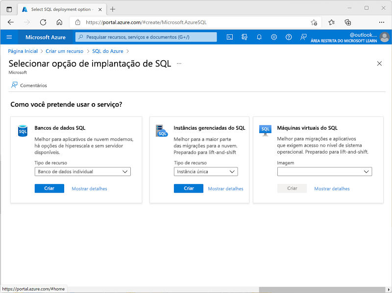
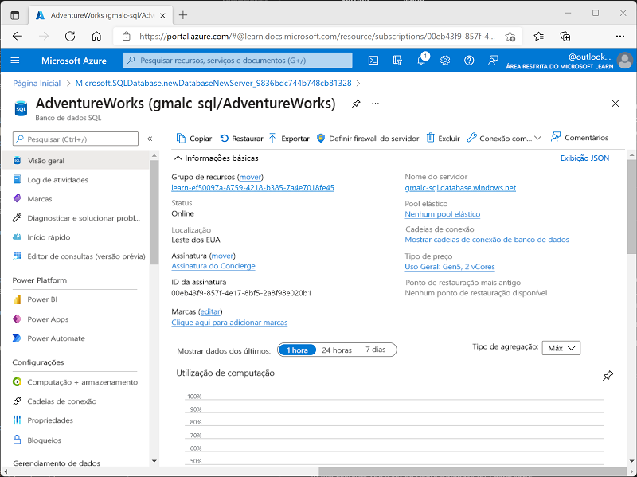
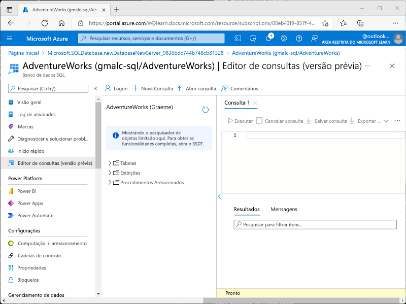
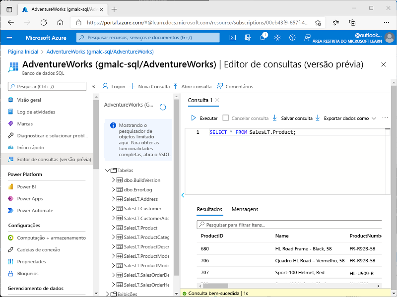

---
lab:
  title: Explorar o Banco de Dados SQL do Azure
  module: Explore relational data in Azure
---

# <a name="explore-azure-sql-database"></a>Explorar o Banco de Dados SQL do Azure

Neste exercício, você vai provisionar um recurso de Banco de Dados SQL do Azure em sua assinatura do Azure e depois usar o SQL para consultar as tabelas em um banco de dados relacional.

Este laboratório levará aproximadamente **15** minutos para ser concluído.

## <a name="before-you-start"></a>Antes de começar

É necessário ter uma [assinatura do Azure](https://azure.microsoft.com/free) com acesso de nível administrativo.

## <a name="provision-an-azure-sql-database-resource"></a>Provisionar um recurso do Banco de Dados SQL do Azure

1. In the <bpt id="p1">[</bpt>Azure portal<ept id="p1">](https://portal.azure.com?azure-portal=true)</ept>, select <bpt id="p2">**</bpt>&amp;#65291; Create a resource<ept id="p2">**</ept> from the upper left-hand corner and search for <bpt id="p3">*</bpt>Azure SQL<ept id="p3">*</ept>. Then in the resulting <bpt id="p1">**</bpt>Azure SQL<ept id="p1">**</ept> page, select <bpt id="p2">**</bpt>Create<ept id="p2">**</ept>.

1. Examine as opções de SQL do Azure que estão disponíveis e, em seguida, no bloco **Bancos de dados SQL**, verifique se a opção **Banco de dados individual** está selecionada e escolha **Criar**.

    

1. Insira os seguintes valores na página **Criar Banco de Dados SQL**:
    - **Assinatura**: Selecione sua assinatura do Azure.
    - **Grupo de recursos**: crie um grupo de recursos com um nome de sua escolha.
    - **Nome do banco de dados**: *AdventureWorks*
    - <bpt id="p1">**</bpt>Server<ept id="p1">**</ept>:  Select <bpt id="p2">**</bpt>Create new<ept id="p2">**</ept> and create a new server with a unique name in any available location. Use <bpt id="p1">**</bpt>SQL authentication<ept id="p1">**</ept> and specify your name as the server admin login and a suitably complex password (remember the password - you'll need it later!)
    - **Deseja usar o pool elástico do SQL?**: *Não*
    - **Computação + armazenamento**: deixar inalterado
    - **Redundância de armazenamento de backup**: *Armazenamento de backup com redundância local*

1. On the <bpt id="p1">**</bpt>Create SQL Database<ept id="p1">**</ept> page, select <bpt id="p2">**</bpt>Next :Networking &gt;<ept id="p2">**</ept>, and on the <bpt id="p3">**</bpt>Networking<ept id="p3">**</ept> page, in the <bpt id="p4">**</bpt>Network connectivity<ept id="p4">**</ept> section, select <bpt id="p5">**</bpt>Public endpoint<ept id="p5">**</ept>. Then select <bpt id="p1">**</bpt>Yes<ept id="p1">**</ept> for both options in the <bpt id="p2">**</bpt>Firewall rules<ept id="p2">**</ept> section to allow access to your database server from Azure services and your current client IP address.

1. Selecione **Avançar: Segurança >** e configure a opção **Habilitar Microsoft Defender para SQL** como **Não agora**.

1. Selecione **Avançar: Configurações adicionais >** e, na guia **Configurações adicionais**, configure a opção **Usar dados existentes** como **Amostra** (isso criará um banco de dados de exemplo que pode ser explorado posteriormente).

1. Selecione **Examinar + Criar** e depois **Criar** para criar o Banco de Dados SQL do Azure.

1. Wait for deployment to complete. Then go to the resource that was deployed, which should look like this:

    

1. No painel no lado esquerdo da página, selecione **Editor de consultas (versão prévia)** e, em seguida, entre usando as credenciais de administrador e a senha que você especificou para o servidor.
    
    *Se uma mensagem de erro informando que o endereço IP do cliente não é permitido for exibida, selecione o link IP **Incluir na lista de permitidos o IP...** no final da mensagem para permitir o acesso e tente entrar novamente (anteriormente você adicionou o endereço IP de cliente do seu computador às regras de firewall, mas o editor de consultas pode se conectar por meio de um endereço diferente, dependendo da configuração da rede)*.
    
    O editor de consultas tem essa aparência:
    
    

1. Expanda a pasta **Tabelas** para ver as tabelas no banco de dados.

1. No painel **Consulta 1**, insira a seguinte instrução SQL:

    ```sql
    SELECT * FROM SalesLT.Product;
    ```

1. Selecione **&#9655; Executar** acima da consulta para executá-la e visualizar os resultados, que devem incluir todas as colunas de todas as linhas na tabela **SalesLT.Product**, conforme mostrado abaixo:

    

1. Substitua a instrução SELECT pelo seguinte código e selecione **&#9655; Executar** para executar a nova consulta e revisar os resultados (que incluem somente as colunas **ProductID**, **Name**, **ListPrice** e **ProductCategoryID**):

    ```sql
    SELECT ProductID, Name, ListPrice, ProductCategoryID
    FROM SalesLT.Product;
    ```

1. Agora, experimente a seguinte consulta, que usa uma JOIN para obter o nome da categoria da tabela **SalesLT.ProductCategory**:

    ```sql
    SELECT p.ProductID, p.Name AS ProductName,
            c.Name AS Category, p.ListPrice
    FROM SalesLT.Product AS p
    JOIN [SalesLT].[ProductCategory] AS c
        ON p.ProductCategoryID = c.ProductCategoryID;
    ```

1. Feche o painel do editor de consultas, descartando suas edições.

> **Dica**: se você tiver concluído a exploração do Banco de Dados SQL do Azure, exclua o grupo de recursos criado neste exercício.
