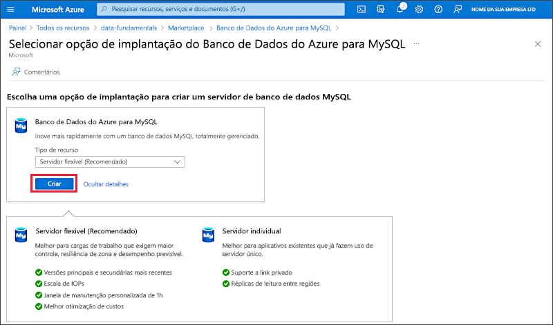
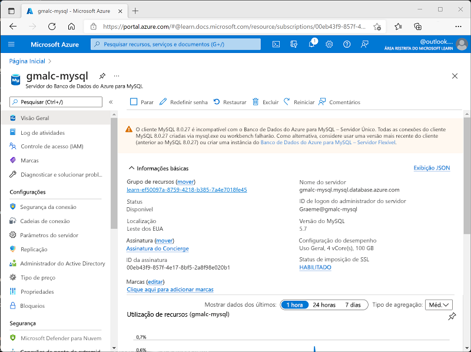

---
lab:
  title: Explorar o Banco de Dados do Azure para MySQL
  module: Explore relational data in Azure
---

# Explorar o Banco de Dados do Azure para MySQL

Neste exercício, você provisionará um recurso de Banco de Dados do Azure para MySQL em sua assinatura do Azure.

Este laboratório levará aproximadamente **5** minutos para ser concluído.

## Antes de começar

É necessário ter uma [assinatura do Azure](https://azure.microsoft.com/free) com acesso de nível administrativo.

## Provisionar um recurso do Banco de Dados do Azure para MySQL

Neste exercício, você provisionará um recurso do Banco de Dados do Azure para MySQL.

1. In the Azure portal, select <bpt id="p1">**</bpt>&amp;#65291; Create a resource<ept id="p1">**</ept> from the upper left-hand corner and search for <bpt id="p2">*</bpt>Azure Database for MySQL<ept id="p2">*</ept>. Then in the resulting <bpt id="p1">**</bpt>Azure Database for MySQL<ept id="p1">**</ept> page, select <bpt id="p2">**</bpt>Create<ept id="p2">**</ept>.

1. Review the Azure Database for MySQL options that are available. Then for <bpt id="p1">**</bpt>Resource type<ept id="p1">**</ept>, select <bpt id="p2">**</bpt>Flexible Server<ept id="p2">**</ept> and select <bpt id="p3">**</bpt>Create<ept id="p3">**</ept>.

    

1. Insira os seguintes valores na página **Criar Banco de Dados SQL**:
    - **Assinatura**: Selecione sua assinatura do Azure.
    - **Grupo de recursos**: crie um grupo de recursos com um nome de sua escolha.
    - **Nome do servidor**: insira um nome exclusivo.
    - **Região**: qualquer local disponível perto de você.
    - **Versão do MySQL**: não alterar.
    - **Tipo de carga de trabalho**: para projetos de desenvolvimento ou hobby.
    - **Computação + armazenamento**: não alterar.
    - **Zona de disponibilidade**: não alterar.
    - **Habilitar alta disponibilidade**: não alterar.
    - **Nome de usuário administrador**: seu nome
    - **Senha** e **Confirmar senha**: uma senha devidamente complexa

1. Selecione **Avançar: Rede**.

1. Em **Regras de firewall**, selecione **&#65291; Adicionar endereço IP do cliente atual**.

1. Selecione **Examinar + Criar** e depois **Criar** para criar o Banco de Dados MySQL do Azure.

1. Wait for deployment to complete. Then go to the resource that was deployed, which should look like this:

    

1. Examine as opções de gerenciamento do seu recurso do Banco de Dados do Azure para MySQL.

> **Dica**: se você tiver concluído a exploração do Banco de Dados do Azure para MySQL, exclua o grupo de recursos criado neste exercício.
