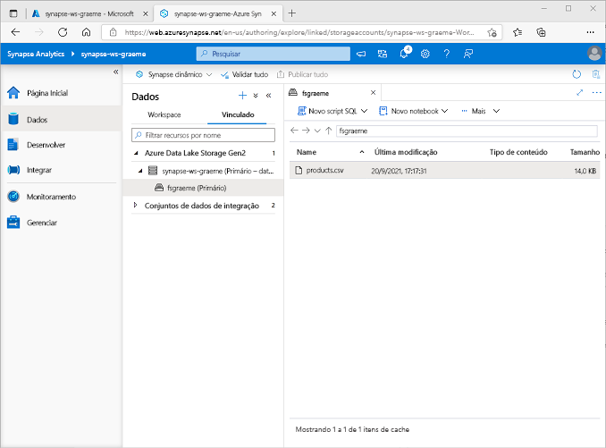
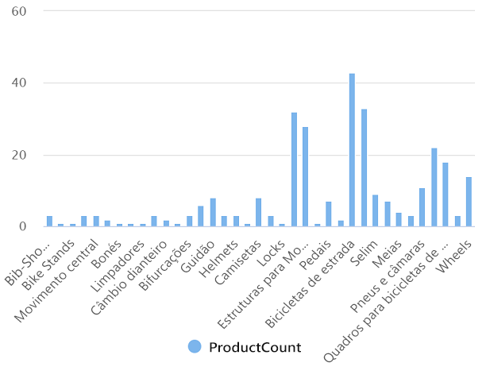
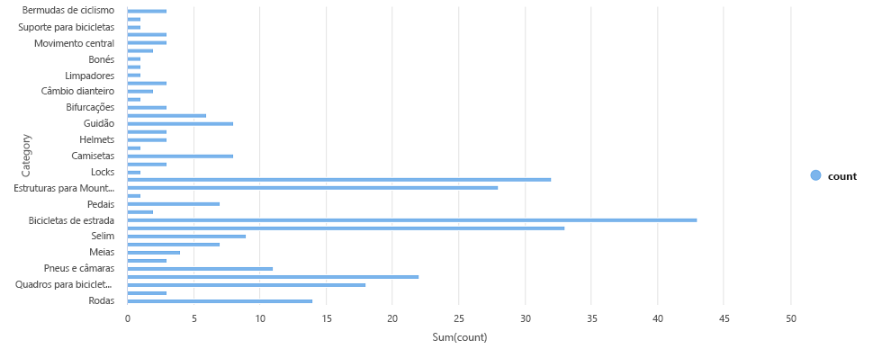

---
lab:
  title: Explorar a análise de dados no Azure com o Azure Synapse Analytics
  module: Explore fundamentals of large-scale data warehousing
---

# <a name="explore-data-analytics-in-azure-with-azure-synapse-analytics"></a>Explorar a análise de dados no Azure com o Azure Synapse Analytics

Neste exercício, você vai provisionar um workspace do Azure Synapse Analytics em sua assinatura do Azure e usá-lo para ingerir e consultar dados.

Este laboratório levará aproximadamente **30** minutos para ser concluído.

## <a name="before-you-start"></a>Antes de começar

É necessário ter uma [assinatura do Azure](https://azure.microsoft.com/free) com acesso de nível administrativo.

## <a name="provision-an-azure-synapse-analytics-workspace"></a>Provisionar um workspace do Azure Synapse Analytics

Para usar o Azure Synapse Analytics, você precisa provisionar um recurso de workspace do Azure Synapse Analytics em sua assinatura do Azure.

1. Abra o portal do Azure em [https://portal.azure.com](https://portal.azure.com?azure-portal=true) e entre usando as credenciais associadas a sua assinatura do Azure.

    > <bpt id="p1">**</bpt>Tip<ept id="p1">**</ept>:  Ensure you are working in the directory containing your subscription - indicated at the top right under your user ID. If not, select the user icon and switch directory.

2. Na portal do Azure, na **Página Inicial**, use o ícone **&#65291; Criar um recurso** para criar um recurso.
3. Pesquise por *Azure Synapse Analytics* e crie um recurso do **Azure Synapse Analytics** com as seguintes configurações:
    - **Assinatura**: *sua assinatura do Azure*
        - **Grupo de recursos**: *Criar um grupo de recursos com um nome apropriado, como "synapse-rg"*
        - **Grupo de recursos gerenciado**: *Insira um nome apropriado, por exemplo, "synapse-managed-rg"*.
    - **Nome do workspace**: *insira um nome de workspace exclusivo, por exemplo, "synapse-ws-<your_name>"* .
    - **Região**: *selecione uma das seguintes regiões*:
        - Leste da Austrália
        - Centro dos EUA
        - Leste dos EUA 2
        - Norte da Europa
        - Centro-Sul dos Estados Unidos
        - Sudeste Asiático
        - Sul do Reino Unido
        - Europa Ocidental
        - Oeste dos EUA
        - WestUS 2
    - **Selecione o Data Lake Storage Gen 2**: Da assinatura
        - **Nome da conta**: *Crie conta com um nome exclusivo, por exemplo, "datalake<seu_nome>"*.
        - **Nome do sistema de arquivos**: *Crie um sistema de arquivos com um nome exclusivo, por exemplo "fs<seu_nome>"*.

    > <bpt id="p1">**</bpt>Note<ept id="p1">**</ept>: A Synapse Analytics workspace requires two resource groups in your Azure subscription; one for resources you explicitly create, and another for managed resources used by the service. It also requires a Data Lake storage account in which to store data, scripts, and other artifacts.

4. Depois de inserir esses detalhes, selecione **Revisar + criar** e selecione **Criar** para criar o workspace.
5. Aguarde a criação do workspace, isso levará cerca de cinco minutos.
6. Quando a implantação for concluída, vá para o grupo de recursos que foi criado e observe que ele contém o workspace do Synapse Analytics e uma conta de armazenamento Data Lake.
7. Selecione o seu workspace do Synapse e a página de **Visão Geral** dele, no cartão do **Open Synapse Studio**, selecione **Abrir** para abrir o Synapse Studio em uma nova guia do navegador. O Synapse Studio é uma interface baseada na Web que pode ser usada para trabalhar com o seu workspace do Synapse Analytics.
8. No lado esquerdo do Synapse Studio, use o ícone **&rsaquo;&rsaquo;** para expandir o menu, isso revela as diferentes páginas no Synapse Studio que você usará para gerenciar recursos e executar tarefas de análise de dados, como mostrado aqui:

    

## <a name="ingest-data"></a>Ingestão de dados

Uma das principais tarefas que você pode executar com o Azure Synapse Analytics é definir *pipelines* que transferem (e, se necessário, transformam) dados de uma ampla gama de fontes no seu workspace para análise.

1. No Synapse Studio, na **Home page**, selecione **Ingerir** e escolha **Tarefa de cópia interna** para abrir a ferramenta **Copiar Dados**.
2. Na ferramenta Copiar Dados, na etapa **Propriedades**, verifique se **Tarefa de cópia interna** e **Executar agora** estão selecionados e clique em **Avançar >**.
3. Na etapa de **Origem**, na subetapa de **Conjunto de dados**, selecione as seguintes configurações:
    - **Tipo de fonte**: Todas
    - **Conexão**: *Crie uma nova conexão e, no painel de **Serviço vinculado** exibido, na guia **Arquivo**, selecione **HTTP**. Então crie uma conexão com um arquivo de dados usando as seguintes configurações:*
        - **Nome**: Produtos da AdventureWorks
        - **Descrição**: Lista de produtos via HTTP
        - **Conectar por meio de runtime de integração**: AutoResolveIntegrationRuntime
        - **URL Base**: `https://raw.githubusercontent.com/MicrosoftLearning/DP-900T00A-Azure-Data-Fundamentals/master/Azure-Synapse/products.csv`
        - **Validação de Certificado do Servidor**: Habilitar
        - **Tipo de autenticação**: Anônimo
4. Depois de criar a conexão, na subetapa de **Origem/Conjunto de Dados**, verifique se as seguintes configurações estão selecionadas e selecione **Avançar >**:
    - **URL Relativa**: *Deixar em branco*
    - **Método de solicitação**: GET
    - **Cabeçalhos adicionais**: *Deixar em branco*
    - **Cópia binária**: <u>Des</u>marcada
    - **Tempo limite de solicitação**: *Deixar em branco*
    - **Máximo de conexões simultâneas**: *Deixar em branco*
5. Na etapa **Origem**, na subetapa **Configuração**, selecione **Visualizar dados** para ver uma prévia dos dados do produto que seu pipeline ingerirá e, em seguida, feche a prévia.
6. Depois de visualizar os dados, na etapa de **Origem/Configuração**, verifique se as seguintes configurações estão selecionadas e selecione **Avançar >**:
    - **Formato de arquivo**: DelimitedText
    - **Delimitador de colunas**: Vírgula (,)
    - **Delimitador de linha**: Alimentação de linha (\n)
    - **Primeira linha como cabeçalho**: Selecionada
    - **Tipo de compactação**: Nenhum
7. Na etapa de **Destino**, na subetapa de **Conjunto de dados**, selecione as seguintes configurações:
    - **Tipo de destino**: Azure Data Lake Storage Gen 2
    - **Conexão**: *selecione a conexão existente com o data lake store (gerado para você no momento da criação do workspace).*
8. Depois de selecionar a conexão, na etapa **Destino/conjunto de dados**, verifique se as seguintes configurações estão selecionadas e, em seguida, clique em **Avançar >** :
    - **Caminho da pasta**: *Navegue para a pasta do seu sistema de arquivos*
    - **Nome do arquivo**: products.csv
    - **Comportamento da cópia**: Nenhum
    - **Máximo de conexões simultâneas**: *Deixar em branco*
    - **Tamanho do bloco (MB)**: *Deixar em branco*
9. On the <bpt id="p1">**</bpt>Target<ept id="p1">**</ept> step, in the <bpt id="p2">**</bpt>Configuration<ept id="p2">**</ept> substep, ensure that the following properties are selected. Then select <bpt id="p1">**</bpt>Next &gt;<ept id="p1">**</ept>:
    - **Formato de arquivo**: DelimitedText
    - **Delimitador de colunas**: Vírgula (,)
    - **Delimitador de linha**: Alimentação de linha (\n)
    - **Adicionar cabeçalho ao arquivo**: Selecionado
    - **Tipo de compactação**: Nenhum
    - **Máximo de linhas por arquivo**: *Deixar em branco*
    - **Prefixo do nome do arquivo**: *Deixar em branco*
10. Na etapa **Configurações**, insira estas configurações e clique em **Avançar >**:
    - **Nome da tarefa**: Copiar produtos
    - **Descrição da tarefa** Copiar dados dos produtos
    - **Tolerância a falhas**: *Deixar em branco*
    - **Habilitar registro em log**: <u>Des</u>marcado
    - **Habilitar processo de preparo**: <u>Des</u>marcado
11. Na etapa **Revisar e concluir**, na subetapa **Revisar**, leia o resumo e clique em **Avançar >**.
12. Na etapa de **Implantar**, aguarde a implantação do pipeline e clique em **Concluir**.
13. No Synapse Studio, selecione a página **Monitorar** e, na guia **Execuções de pipeline**, aguarde até que o pipeline **Copiar produtos** seja concluído com um status de **Sucesso** (é possível usar o botão **&#8635; Atualizar** na página Execuções de pipeline para atualizar o status).
14. On the <bpt id="p1">**</bpt>Data<ept id="p1">**</ept> page, select the <bpt id="p2">**</bpt>Linked<ept id="p2">**</ept> tab and expand the <bpt id="p3">**</bpt>Azure Data Lake Storage Gen 2<ept id="p3">**</ept> hierarchy until you see the file storage for your Synapse workspace. Then select the file storage to verify that a file named <bpt id="p1">**</bpt>products.csv<ept id="p1">**</ept> has been copied to this location, as shown here:

    

## <a name="use-a-sql-pool-to-analyze-data"></a>Usar um pool de SQL para analisar os dados

Now that you've ingested some data into your workspace, you can use Synapse Analytics to query and analyze it. One of the most common ways to query data is to use SQL, and in Synapse Analytics you can use a <bpt id="p1">*</bpt>SQL pool<ept id="p1">*</ept> to run SQL code.

1. No Synapse Studio, clique com o botão direito do mouse no arquivo **products.csv** no armazenamento de arquivos do seu workspace do Synapse, aponte para **Novo script de SQL** e escolha **Selecionar as 100 linhas superiores**.
2. No painel **Script SQL 1** que será aberto, revise o código de SQL que foi gerado, que deve ser semelhante a este:

    ```SQL
    -- This is auto-generated code
    SELECT
        TOP 100 *
    FROM
        OPENROWSET(
            BULK 'https://datalakexx.dfs.core.windows.net/fsxx/products.csv',
            FORMAT = 'CSV',
            PARSER_VERSION='2.0'
        ) AS [result]
    ```

    Esse código abre um conjunto de linhas do arquivo de texto que você importou e recupera as primeiras 100 linhas de dados.

3. Na lista **Conectar-se a**, verifique se **Interno** está selecionado — isso representa o Pool de SQL interno que foi criado com o seu workspace.
4. Na barra de ferramentas, use o botão **&#9655; Executar** para executar o código SQL e examine os resultados, que devem ser semelhantes a este:

    | C1 | c2 | c3 | c4 |
    | -- | -- | -- | -- |
    | ProductID | ProductName | Categoria | ListPrice |
    | 771 | Mountain-100 Silver, 38 | Mountain bikes | 3399.9900 |
    | 772 | Mountain-100 Silver, 42 | Mountain bikes | 3399.9900 |
    | ... | ... | ... | ... |

5. Note the results consist of four columns named C1, C2, C3, and C4; and that the first row in the results contains the names of the data fields. To fix this problem, add a HEADER_ROW = TRUE parameters to the OPENROWSET function as shown here (replacing <bpt id="p1">*</bpt>datalakexx<ept id="p1">*</ept> and <bpt id="p2">*</bpt>fsxx<ept id="p2">*</ept> with the names of your data lake storage account and file system), and then rerun the query:

    ```SQL
    SELECT
        TOP 100 *
    FROM
        OPENROWSET(
            BULK 'https://datalakexx.dfs.core.windows.net/fsxx/products.csv',
            FORMAT = 'CSV',
            PARSER_VERSION='2.0',
            HEADER_ROW = TRUE
        ) AS [result]
    ```

    Agora, os resultados terão a seguinte aparência:

    | ProductID | ProductName | Categoria | ListPrice |
    | -- | -- | -- | -- |
    | 771 | Mountain-100 Silver, 38 | Mountain bikes | 3399.9900 |
    | 772 | Mountain-100 Silver, 42 | Mountain bikes | 3399.9900 |
    | ... | ... | ... | ... |

6. Modifique a consulta da seguinte maneira (substituindo *datalakexx* e *fsxx* pelos nomes da conta de armazenamento do data lake e do sistema de arquivos):

    ```SQL
    SELECT
        Category, COUNT(*) AS ProductCount
    FROM
        OPENROWSET(
            BULK 'https://datalakexx.dfs.core.windows.net/fsxx/products.csv',
            FORMAT = 'CSV',
            PARSER_VERSION='2.0',
            HEADER_ROW = TRUE
        ) AS [result]
    GROUP BY Category;
    ```

7. Execute a consulta modificada, que retornará um conjunto de resultados contendo o número de produtos em cada categoria, desta forma:

    | Categoria | ProductCount |
    | -- | -- |
    | Bib Shorts | 3 |
    | Racks de bicicleta | 1 |
    | ... | ... |

8. In the <bpt id="p1">**</bpt>Properties<ept id="p1">**</ept> pane for <bpt id="p2">**</bpt>SQL Script 1<ept id="p2">**</ept>, change the <bpt id="p3">**</bpt>Name<ept id="p3">**</ept> to <bpt id="p4">**</bpt>Count Products by Category<ept id="p4">**</ept>. Then in the toolbar, select <bpt id="p1">**</bpt>Publish<ept id="p1">**</ept> to save the script.

9. Feche o painel do script **Contar Produtos por Categoria**.

10. No Synapse Studio, selecione a página **Desenvolver** e observe que seu script SQL **Contar Produtos por Categoria** publicado foi salvo nela.

11. Select the <bpt id="p1">**</bpt>Count Products by Category<ept id="p1">**</ept> SQL script to reopen it. Then ensure that the script is connected to the <bpt id="p1">**</bpt>Built-in<ept id="p1">**</ept> SQL pool and run it to retrieve the product counts.

12. No painel de **Resultados**, selecione o modo de exibição de **Gráfico** e selecione as seguintes configurações para o gráfico:
    - **Tipo de gráfico**: Coluna
    - **Coluna de categoria**: Categoria
    - **Colunas de legenda (série)**: ProductCount
    - **Posição da legenda**: Inferior central
    - **Rótulo de legenda (série)**: *Deixar em branco*
    - **Valor mínimo da legenda (série)**: *Deixar em branco*
    - **Máximo da legenda (série)**: *Deixar em branco*
    - **Rótulo da categoria**: *Deixar em branco*

    O gráfico resultante deve ser semelhante a este:

    

## <a name="use-a-spark-pool-to-analyze-data"></a>Usar um pool do Spark para analisar os dados

While SQL is a common language for querying structured datasets, many data analysts find languages like Python useful to explore and prepare data for analysis. In Azure Synapse Analytics, you can run Python (and other) code in a <bpt id="p1">*</bpt>Spark pool<ept id="p1">*</ept>; which uses a distributed data processing engine based on Apache Spark.

1. No Synapse Studio, selecione a página **Gerenciar**.
2. Selecione a guia **pools do Apache Spark** e use o ícone **&#65291; Novo** para criar um pool do Spark com as seguintes configurações:
    - **Nome do pool do Apache Spark**: spark
    - **Família do tamanho do nó**: Otimizado para memória
    - **Tamanho do nó**: Pequeno (4 vCores / 32 GB)
    - **Dimensionamento automático**: Habilitado
    - **Número de nós** 3----3
3. Revise e crie o pool do Spark e aguarde até que ele seja implantado (o que pode levar alguns minutos).
4. When the Spark pool has been deployed, in Synapse Studio, on the <bpt id="p1">**</bpt>Data<ept id="p1">**</ept> page, browse to the file system for your Synapse workspace. Then right-click <bpt id="p1">**</bpt>products.csv<ept id="p1">**</ept>, point to <bpt id="p2">**</bpt>New notebook<ept id="p2">**</ept>, and select <bpt id="p3">**</bpt>Load to DataFrame<ept id="p3">**</ept>.
5. No painel **Notebook 1** que será exibido, na lista **Anexar a**, selecione o pool do Spark **spark** como criado anteriormente e verifique se a **Linguagem** está configurada como **PySpark (Python)**.
6. Examine o código na primeira (e única) célula no notebook, que terá esta aparência:

    ```Python
    %%pyspark
    df = spark.read.load('abfss://fsxx@datalakexx.dfs.core.windows.net/products.csv', format='csv'
    ## If header exists uncomment line below
    ##, header=True
    )
    display(df.limit(10))
    ```

7.                  **Dica**: verifique se você está trabalhando no diretório que contém a sua assinatura (indicado no canto superior direito embaixo da sua ID de usuário).

    > **Observação**: se ocorrer um erro porque o kernel do Python ainda não está disponível, execute a célula novamente.

8. Eventualmente, os resultados deverão aparecer abaixo da célula e ser semelhantes a este:

    | _c0_ | _c1_ | _c2_ | _c3_ |
    | -- | -- | -- | -- |
    | ProductID | ProductName | Categoria | ListPrice |
    | 771 | Mountain-100 Silver, 38 | Mountain bikes | 3399.9900 |
    | 772 | Mountain-100 Silver, 42 | Mountain bikes | 3399.9900 |
    | ... | ... | ... | ... |

9. Descompacte a linha *header=True* (porque o arquivo products.csv tem os títulos de coluna na primeira linha), para que seu código tenha esta aparência:

    ```Python
    %%pyspark
    df = spark.read.load('abfss://fsxx@datalakexx.dfs.core.windows.net/products.csv', format='csv'
    ## If header exists uncomment line below
    , header=True
    )
    display(df.limit(10))
    ```

10. Execute novamente a célula e verifique se o resultado terá esta aparência:

    | ProductID | ProductName | Categoria | ListPrice |
    | -- | -- | -- | -- |
    | 771 | Mountain-100 Silver, 38 | Mountain bikes | 3399.9900 |
    | 772 | Mountain-100 Silver, 42 | Mountain bikes | 3399.9900 |
    | ... | ... | ... | ... |

    Observe que executar a célula novamente leva menos tempo, porque o pool do Spark já foi iniciado.

11. Nos resultados, use o ícone **&#65291; Código** para adicionar uma nova célula de código ao notebook.
12. Na nova célula de código vazia, adicione o seguinte código:

    ```Python
    df_counts = df.groupBy(df.Category).count()
    display(df_counts)
    ```

13. Selecione **&#9655; Executar** à esquerda para executar a nova célula de código e revisar os resultados, que devem ser semelhantes ao seguinte:

    | Categoria | count |
    | -- | -- |
    | Fones de ouvido | 3 |
    | Rodas | 14 |
    | ... | ... |

14. Caso contrário, selecione o ícone de usuário e o troque o diretório.

    

15. Feche o painel **Notebook 1** e descarte as alterações.

## <a name="delete-azure-resources"></a>Excluir recursos do Azure

Se você terminou de explorar Azure Synapse Analytics, exclua os recursos que criou para evitar custos desnecessários do Azure.

1. Feche a guia do navegador do Synapse Studio e retorne ao portal do Azure.
2. No portal do Azure, na **Página Inicial**, selecione **Grupos de recursos**.
3. Selecione o grupo de recursos para o workspace do Synapse Analytics (não o grupo de recursos gerenciado) e verifique se ele contém o workspace do Synapse, a conta de armazenamento e o pool do Spark para seu workspace.
4. Na parte superior da página de **Visão Geral** do grupo de recursos, selecione **Excluir o grupo de recursos**.
5. Digite o nome do grupo de recursos para confirmar que deseja excluí-lo e selecione **Excluir**.

    Após alguns minutos, seu workspace do Azure Synapse e o workspace gerenciado associado a ele serão excluídos.
